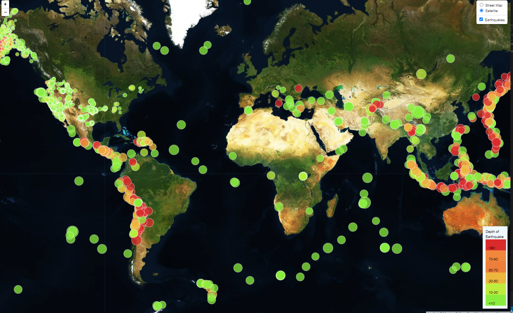

# Leaflet-Challenge
## Creating a map to show Earthquakes around the World

### About this project
* This task utilized earthquake data available from the USGS in JSON format. After analyzing data, a map was created in Leaflet by creating a plot of all earthquake locations in the dataset, their depths, and magnitudes. 
* Markers indicate the magnitude by their radius size, and the depth is indicated by the color, as noted in the legend. 
* The popup indicates the actual location of the earthquake and the actual magnitude.  

### Programs Used
* Leaflet
* HTML
* CSS
* Mapbox
* JSON
* Javascript